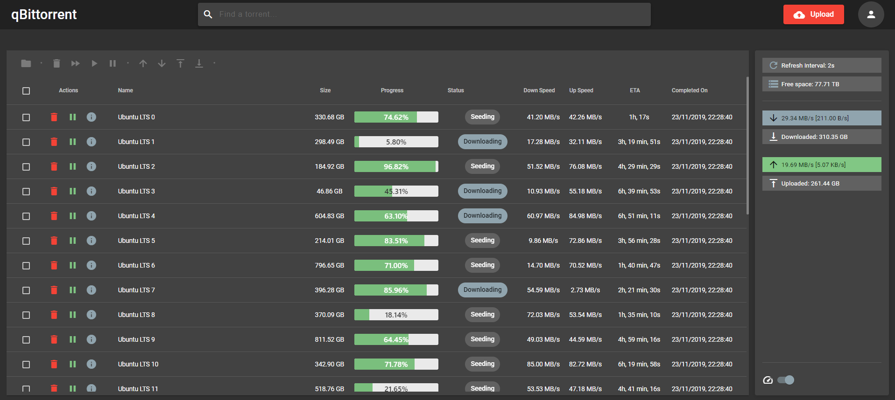

# qBit MatUI  

A material-themed UI for [qBittorrent](https://github.com/qbittorrent/qBittorrent). This interface is more slimmed down, although still contains several features such as:

* Bulk edit (pause, resume, delete, prioritize, and more)
* Sorting by different metrics (name, size, date completed, etc.)
* See torrent contents _before_ downloading
* File system navigation (choose where to save a torrent, create sub-folders, etc.)
* Manage local & qBittorrent preferences
* A fully material-themed UI (Light & Dark themes)
* ... and more!

## Demo!
A live demo is available here: https://qbit-material-webui-demo.herokuapp.com/.

## Installation
This app is tested with **v4.1.5** and higher of qBittorrent, any lower version are not guaranteed to work.

1. Take a production-ready build from [releases](https://github.com/bill-ahmed/qbit-material-WebUI/releases), or [build it yourself](#build)
2. Extract the files into any folder
3. In qBittorrent, under Tools > Options > Web UI > Use alternative Web UI, set the file location as the folder you created in Step 2.
4. Done!

## Development
This app relies on a couple files to work properly.

### General Config
Under `src/assets/` there are two files: `config.json` and `config.prod.json`. This will store general configuration, such as the delimeter used when parsing file paths (Unix vs. Windows).

### HTTP Config
If you wish to configure your endpoints and other data for dev/prod, do so in `src/assets/http_config.json`.

## Running the App
In order to have the most accurate testing environment, we make use of a docker container running qBittorrent. Make
sure you have both Docker and docker-compose installed.

Checkout the instructions in the `dev/` folder on how to set it up.

### Front-end:
1. Run `npm run dev` for a dev server
2. Navigate to `http://localhost:8090/`
3. Username: `admin`; Password: `adminadmin`; This can be changed through the default Web UI.

The app will re-compile everytime you save changes. To see the changes, you must hard-reload the web page (`CTRL + SHIFT + R` on Windows)

## Build

Run `ng build` to build the project. The build artifacts will be stored in the `dist/` directory. Use the `--prod` flag for a production build. 

To get a build for the login page, run `ng build --project="login"`, and provide the `--prod` flag for a production build.
