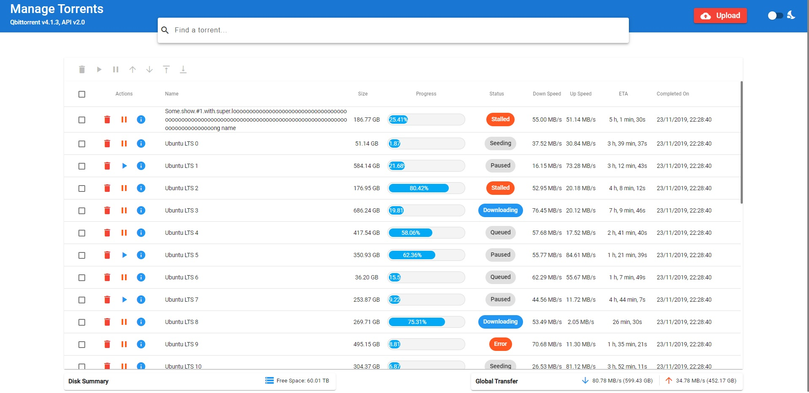

# Qbit Material WebUI  

An alternative Web Interface to the original [qBittorrent Web UI](https://github.com/qbittorrent/qBittorrent). This interface is very slimmed down and contains the following features

* Adding/Deleting torrents
* Bulk edit (pause, resume, delete, prioritize, and more)
* Sorting by different metrics (name, size, date completed, etc.)
* File System Navigation (choose where to save a torrent, create sub-folders, etc.)
* See torrent contents _before_ downloading
* Manage local & qBittorrent preferences
* A fully material-themed UI (Light & Dark themes)
* ... and more!

## Demo!
A live demo is available here: https://qbit-material-webui-demo.herokuapp.com/.

## Installation -- Replacing your existing qBittorrent Web UI
In order to use this version, first follow the instructions outlined [here (*)](https://github.com/qbittorrent/qBittorrent/wiki/Developing-alternate-WebUIs-(WIP)) and [here (**)](https://github.com/qbittorrent/qBittorrent/wiki/Alternate-WebUI-usage). This app is tested with **API v2.2** and higher. Any lower version are not guaranteed to work.

Once you've completed that:

1. Take a production-ready build from [releases](https://github.com/bill-ahmed/qbit-material-WebUI/releases), or [build it yourself](#build)

2. Navigate to wherever you placed the `public`/`private` folder from [(*)](#replacing-your-existing-qbittorrent-web-ui)

3. If you wish to replace the login page, replace all contents of `public` folder with the folder `public` in the downloaded `.zip` file.

4. Replace all the contents of the `private` folder with the folder `private` in the downloaded `.zip` file (alternatively, if you chose to build the app, copy over contents of `dist/` from the project directoy)

# Development
This app relies on a couple files to work properly.

### General Config
Under `src/assets/` there are two files: `config.json` and `config.prod.json`. This will store general configuration, such as the delimeter used when parsing file paths (Unix vs. Windows).

### HTTP Config
Under `src/assets/` there are two files: `http_config.json` and `http_config.prod.json`. During the production build, the former is replaced with the latter file. 

If you wish to configure your endpoints and other data for dev/prod, do so here.

## Running the App
To install the dependencies, run `npm install` in both the root directory and the `mock_backend/` folder.

### Back-end
1. Navigate to `mock_backend` directory
2. Run `node index.js`

### Front-end:
1. Run `ng serve` for a dev server
2. Navigate to `http://localhost:4200/`
3. Username: `admin`; Password: `password`; This can be changed under `mock_backend/config.json`

To run the login page standalone, do: `ng serve login` and navigate to `http://localhost:4200/`.

The app will automatically reload if you make changes to any of the Angular source code.

## Build

Run `ng build` to build the project. The build artifacts will be stored in the `dist/` directory. Use the `--prod` flag for a production build. 

To get a build for the login page, run `ng build --project="login"`, and provide the `--prod` flag for a production build.
